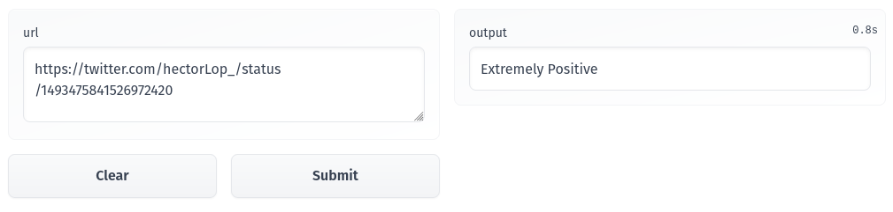

# Tweet Positivity Analyzer
Twitter is a social media network on which users post and interact with messages known as "tweets". It allows a user to post, like, and retweet tweets. 

Twitter is also known for the excessive negativity or criticism by many of its users. Considering that, this application intends to classify a tweet according to its positivity.  

## :star: Solution

The application uses a pre-trained BERT model fine tuned using the [Coronavirus tweets NLP dataset](https://www.kaggle.com/datasets/datatattle/covid-19-nlp-text-classification). This dataset contains 48.000 tweets classified into the following five categories:

- Extremely negative
- Negative
- Neutral
- Positive
- Extremely positive

Currently, the application is deployed using Hugginface Spaces, accessible in this [URL](https://huggingface.co/spaces/hlopez/Twitter-Positivity-Analyzer).

#### :red_car: Roadmap

- [X] Implement a CI pipeline
- [ ] Implement a CD pipeline
- [ ] Implement a CT pipeline
- [ ] Deploy the backend on AWS Lambda
- [ ] Deploy the gradio app on an EC2 instance
- [ ] Implement a monitoring solution to detect data drift
